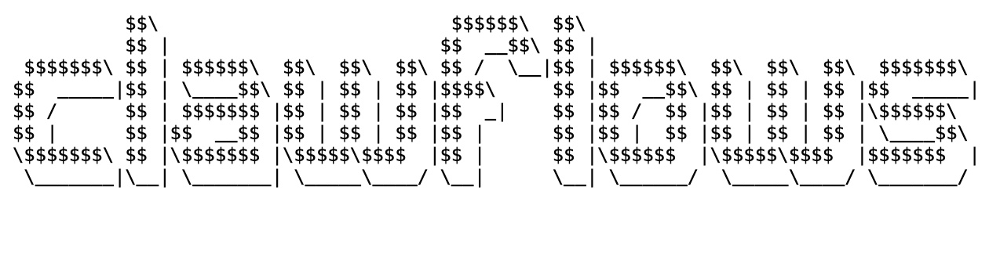

<!-- # >> clawflows -->

<picture>
  <source media="(prefers-color-scheme: dark)" srcset="ascii-art-text-dark.png">
  <source media="(prefers-color-scheme: light)" srcset="ascii-art-text-light.png">
  
</picture>

My personal collection of workflows for **OpenClaw** — the ones I actually use.  
Automate multi‑step tasks through 🐾 OpenClaw's agentic framework.

## What is this?

A set of ready‑to‑use **workflows** for [OpenClaw](https://openclaw.ai) — the open‑source AI agent that runs locally and connects to your chat apps. Each workflow automates a repeatable process so you can trigger complex tasks with a simple message.

## Installation

Install all workflows from this repository:
```bash
openclaw skills install albertolicea00/clawflows
```

Or install a single workflow:
```bash
openclaw skills install albertolicea00/clawflows/<workflow-name>
```

## Related repos

Good people building good things in the same space ✨ go give them a star:

- [**albertolicea00/agentskills**](https://github.com/albertolicea00/agentskills) — my collection of agent skills.
- [**nikilster/clawflows**](https://github.com/nikilster/clawflows) — the original project this one is based on. ([clawflows.com](https://clawflows.com/))

## License

[MIT](LICENSE) — Powered by @albertolicea00 and his unstoppable AI‑agents

> 🤖 Many of these workflows are **AI‑generated** and then reviewed & refined by me. The AI drafts, I review — nothing gets merged without my approval.

<!-- <a href="https://github.com/albertolicea00/clawflows/graphs/contributors">
  
</a>

Made with [contrib.rocks](https://contrib.rocks). -->